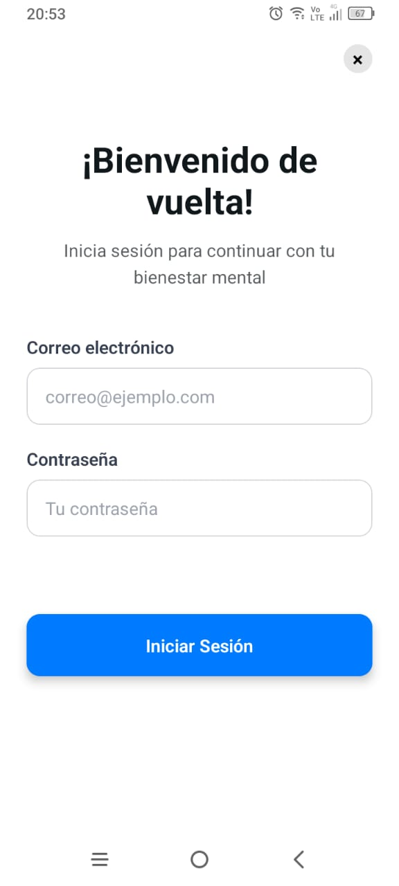

# MindTrack app UI

## Pantallas iniciales

- Home

- Registro

- Inicio de sesión

- Dashboard

- Lista de tareas (en progreso)

## Requisitos de entrega completados

- [x] Pantallas: Crear al menos 4 pantallas principales interconectadas mediante navegación (Expo Router o React Navigation).
- [x] Componentes: Usar componentes básicos de React Native (View, Text, Image, ScrollView, FlatList, etc.).
- [x] Formulario: Incluir al menos un formulario (p. ej., login y registro).

### Estilos:

- [x] Uso de StyleSheetAPI.
- [x] Uso de Styled Components en al menos una pantalla.
- [x] Diseño responsivo utilizando Flexbox.