# Entrega Final

- Grupo 19: Lara Alegre y Agustin Sanchez

## Secciones

### Home

### Registro

- Uso de nuestra API local para manejar toda la autenticación.
- Todos los inputs tienen validaciones. 
- Se corrigieron detalles en la muestra de mensajes de error de los inputs. 
- Se agregó el botón para poder ver/ocultar la contraseña.

### Inicio de sesión

- Lo mismo que en la sección de registro.

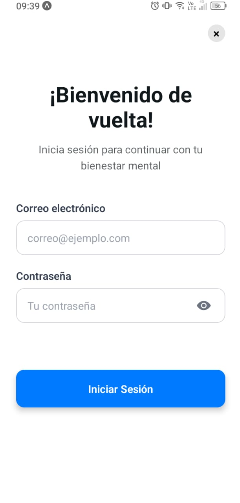

### Dashboard

- Se cambió el aspecto de las cards de las secciones (6 en total). 
- Se agregó el saludo con el nombre del usuario autenticado.

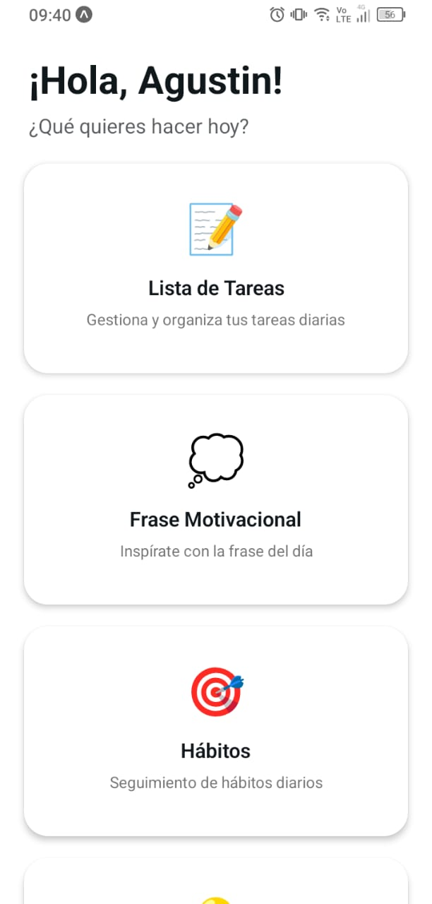
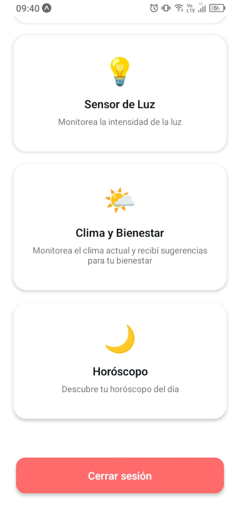

### Lista de tareas

- Persistencia usando nuestra base de datos MySQL local.
- Acciones de crear, editar y eliminar usando nuestra API local.
- Modal de confirmación antes de eliminar items.

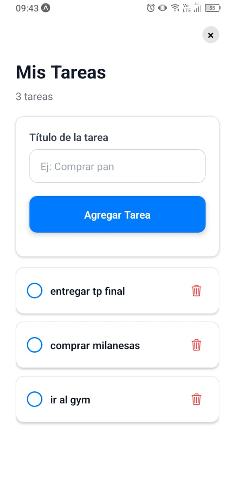
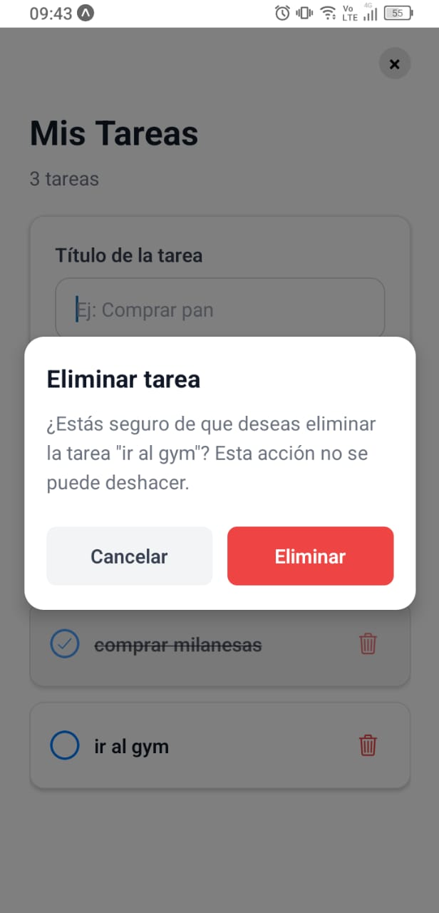
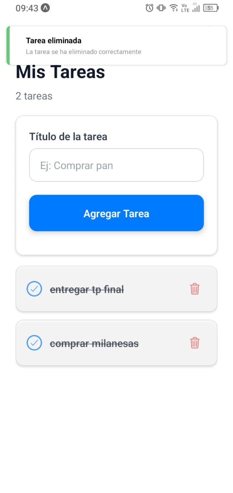

### Frase motivacional

- Consumo de API externa para traer diferentes frases diarias.
- Consumo de API externa para traducir el texto de las frases.
- Manejo de loading cuando se está consultando la data.
- Manejo de error en caso de fallos al consultar los datos.
- Funcionalidad extra: posibilidad de compartir la card de la frase.

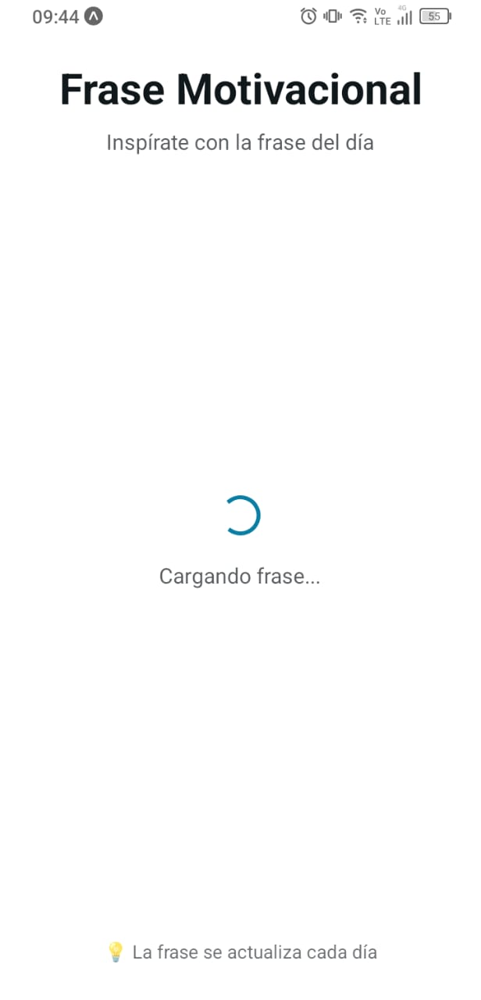

### Habitos

- Persistencia usando nuestra base de datos MySQL local.
- Acciones de crear, editar y eliminar usando nuestra API local.
- Posibilidad de configurar recordatorios diarios usando expo-notifications. La hora del recordatorio se persiste en nuestra base de datos local.

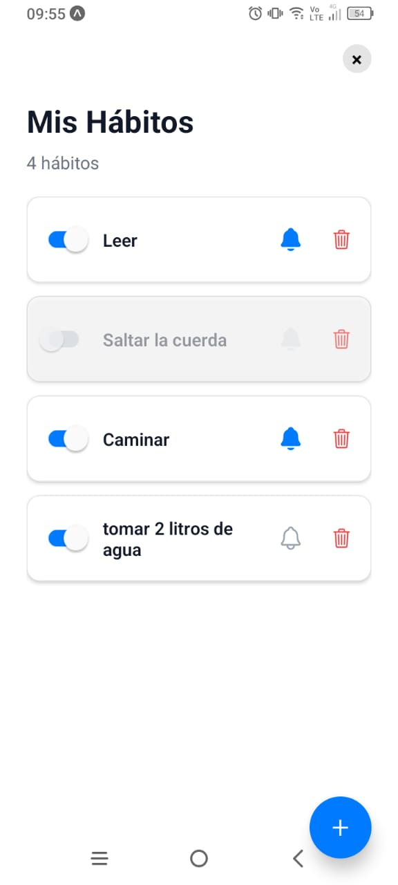
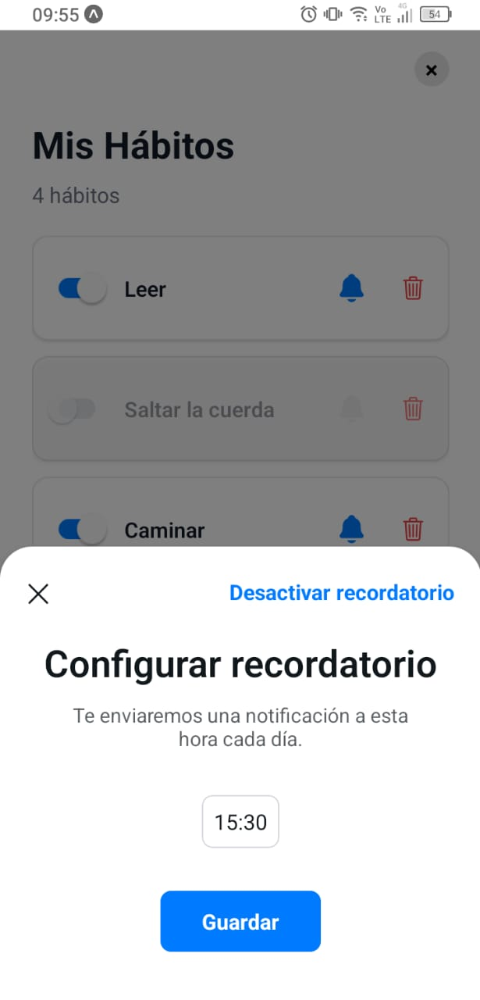
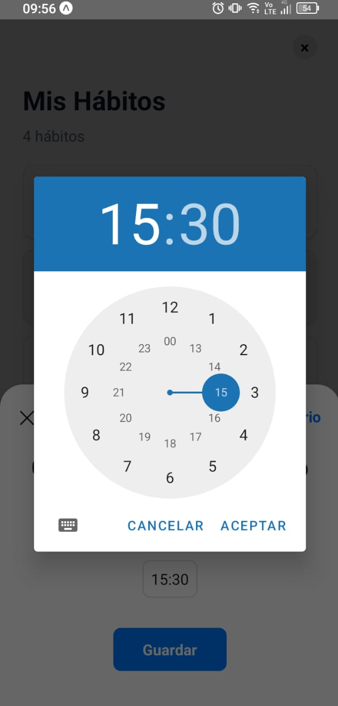

### Sensor de Luz

- Uso de servicio del dispositivo: sensor de luz con expo-sensors.
- Manjeo de error en caso de que el dispositivo no tenga el sensor.

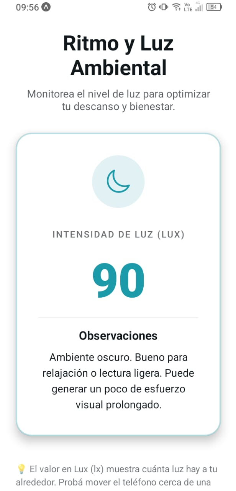

### Clima

- Uso de servicio del dispositivo: ubicación con expo-location.
- Consumo de API externa para traer los datos del clima.
- Si el usuario no permite el acceso a su ubicación, se mostrará el clima de Buenos Aires por default.

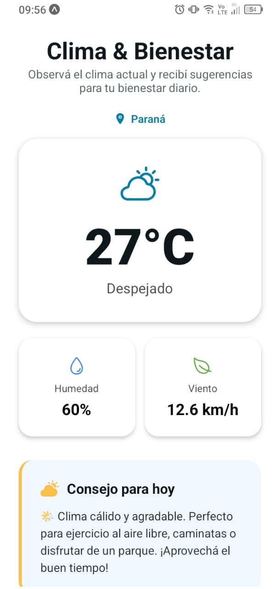

### Horoscopo

- Consumo de API externa para traer los diferentes horoscopos diarios.
- Consumo de API externa para traducir el texto de los horoscopos.
- Manejo de loading cuando se está consultando la data.

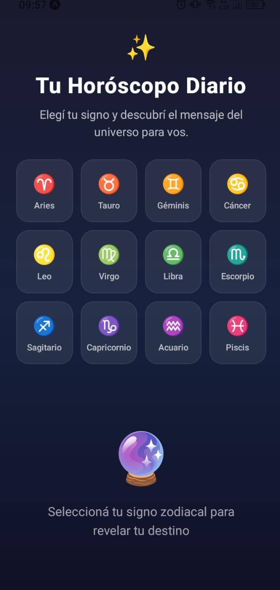
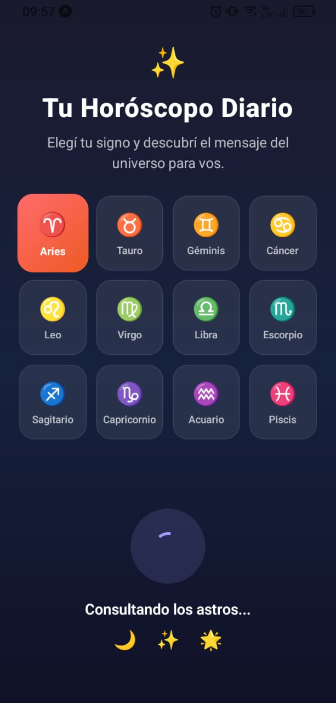

